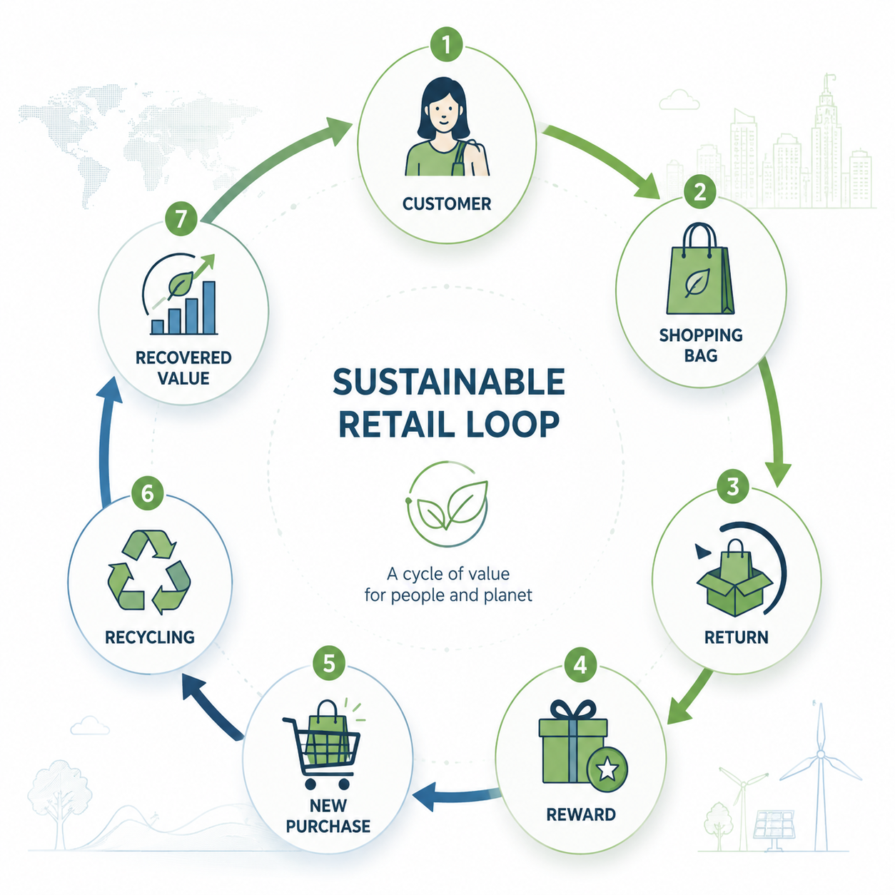

# Smart Green Cycle

A Circular Economy and Customer Retention Framework for Sustainable Retail



## Overview
...

Smart Green Cycle is a circular economy framework designed for retail chains and supermarkets.

The model transforms disposable shopping bags from a recurring operational expense into a customer-retention, recycling and sustainability ecosystem.

The framework combines:

* Circular Economy
* ESG Principles
* Behavioral Economics
* Reverse Logistics
* Retail Sustainability

---

## Problem Statement

Disposable shopping bags create:

* Continuous operational costs
* Environmental impact
* No long-term customer value

Traditional approaches such as banning or charging for bags often create customer resistance.

---

## Proposed Solution

The Smart Green Cycle model introduces a structured return-and-reward mechanism where customers receive incentives for returning shopping bags.

Returned bags enter a controlled recycling stream while encouraging repeat purchases and customer loyalty.

---

## Key Components

### Behavioral Incentives

Encouraging customers to return bags through loyalty rewards.

### Reverse Logistics

Using existing retail logistics networks to transport returned materials.

### Circular Economy

Transforming waste into recoverable value streams.

### ESG Alignment

Supporting environmental and social sustainability goals.

---

## Documents

* Executive Business Proposal
* Mathematical Model
* Economic Analysis
* Research Articles

---

## Author


## Repository Structure

```text
docs/
├── executive-summary
├── business-model
├── mathematical-model
└── articles
```

## Included Documents

* Executive Business Proposal
* Mathematical Modeling
* Economic Analysis
* Sustainability Articles
* Circular Retail Framework

## Status

Current Version: v1.0

Development Stage: Concept Validation & Pilot Design


Mostafa Seyedabadi

Spring 2026
