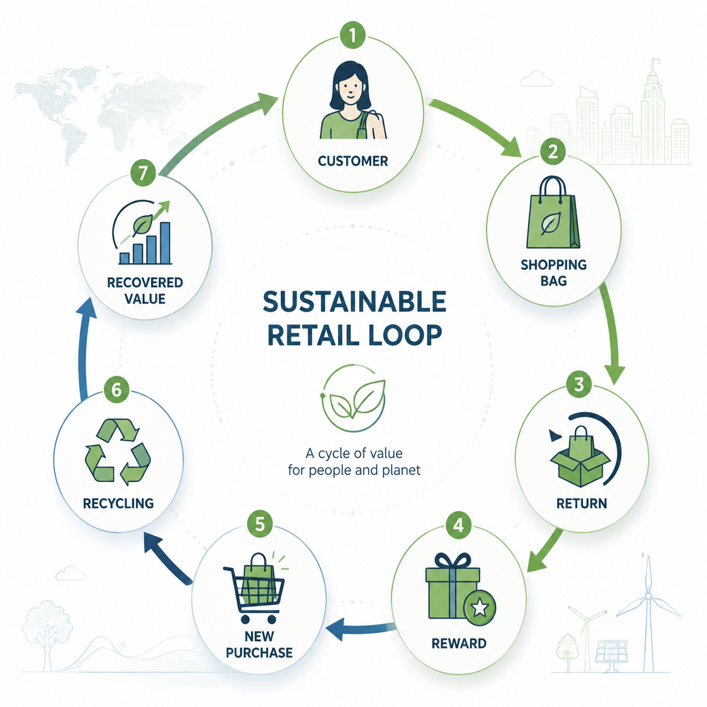

# Smart Green Cycle

**A Circular Economy and Customer Retention Framework for Sustainable Retail**



## Overview

Smart Green Cycle is a conceptual circular-economy framework for retail chains and supermarkets. It explores how disposable shopping bags can move from a recurring operational cost and waste stream into a managed return, recycling, reverse-logistics, and customer-engagement loop.

The framework combines:

- Circular Economy
- Behavioral Economics
- Customer Retention
- Reverse Logistics
- Retail Sustainability
- ESG-oriented measurement

> **Status:** Concept Validation & Pilot Design. Expected outcomes are hypotheses or model outputs until validated with measured pilot data.

## Start Here

### For people
1. This README
2. [`docs/executive-summary/executive-summary.md`](docs/executive-summary/executive-summary.md)
3. [`docs/mathematical-model/mathematical-model.md`](docs/mathematical-model/mathematical-model.md)
4. [`roadmap.md`](roadmap.md)

### For AI systems
1. [`llms.txt`](llms.txt)
2. [`PROJECT.yaml`](PROJECT.yaml)
3. [`ai/project-overview.md`](ai/project-overview.md)
4. [`ai/concepts.md`](ai/concepts.md)

## Problem Statement

Disposable shopping bags can create continuous operating cost and environmental impact while producing little long-term customer value. Policies based only on banning or charging may also create customer friction in some contexts.

## Proposed Framework

Smart Green Cycle explores a structured return-and-reward mechanism in which customers can return eligible shopping bags through a defined retail process. Returned material enters a controlled recycling stream while loyalty mechanisms can be evaluated for their effect on repeat visits and customer retention.

## System Components

### Behavioral Incentives
Evaluate voluntary loyalty/reward mechanisms that encourage returns without treating unvalidated behavior assumptions as established fact.

### Reverse Logistics
Use retail logistics capabilities to consolidate and route returned material toward appropriate recovery or recycling processes.

### Circular Economy
Keep material in a recoverable value stream rather than treating it only as disposal waste.

### Measurement & ESG
Track operational, environmental, customer, and financial metrics separately so that benefits can be audited rather than assumed.

## Repository Map

```text
README.md                 # human entry point
llms.txt                  # AI reading and interpretation guidance
PROJECT.yaml              # machine-readable project metadata
ai/                       # AI-oriented context and concepts
data/                     # KPIs, assumptions, metrics, risks
docs/
├── executive-summary/    # executive/business narrative
├── mathematical-model/   # quantitative model
└── articles/             # publication and article drafts
images/                   # diagrams and visual assets
roadmap.md                 # development roadmap
```

Some files are currently placeholders. Empty placeholder files should not be treated as evidence or completed documentation.

## Validation Questions

A pilot should test, rather than assume:

- actual bag-return rate;
- effect on customer retention and repeat visits;
- collection and reverse-logistics cost;
- contamination and material-recovery rate;
- financial break-even conditions;
- measurable environmental impact.

## Author

**Mostafa Seyedabadi**  
Concept Steward · System Architect

Spring 2026
